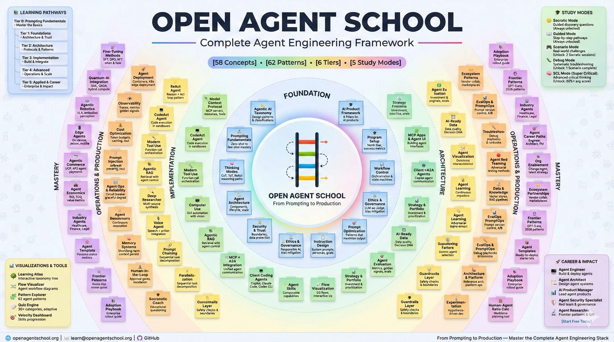

#  Open Agent School

[](https://github.com/bhakthan/OpenAgentSchool/actions/workflows/azure-static-web-apps-gray-pond-041017f10.yml)
[](https://github.com/bhakthan/OpenAgentSchool/releases)
[](LICENSE)
[](https://deepwiki.com/bhakthan/OpenAgentSchool)
[](https://www.linkedin.com/comm/mynetwork/discovery-see-all?usecase=PEOPLE_FOLLOWS&followMember=bhakthan)

> **Where AI Agent Concepts Come to Life**  
> _An interactive learning platform for mastering AI agents, patterns, and production architectures_

<p align="center">
  
</p>

**Live Platform:** [openagentschool.org](https://openagentschool.org)

---

## What's Inside

| | Question | Answer |
|---|----------|--------|
| **Why** | Why does this exist? | Most AI agent resources are scattered blog posts or vendor docs. Open Agent School brings concepts, patterns, and production practices into one interactive platform — so you learn the *why* behind each pattern, not just the API call. |
| **What** | What does it cover? | 65+ agent patterns, 200+ quiz questions, interactive D3 visualizations, Socratic study mode, critical thinking challenges, exportable diagrams (SVG/PNG/PDF), and downloadable strategy toolkits — from fundamentals to production ops. |
| **Where** | Where does it run? | **Web** — live at [openagentschool.org](https://openagentschool.org). **PWA** — install on mobile or desktop for offline access. **Local dev** — clone the repo and `npm run dev` on localhost:5000. |
| **When** | When should I use it? | When you're learning AI agents for the first time, evaluating patterns for a production system, preparing for a technical interview, or onboarding a team to agentic architecture — from first concept to org-wide adoption. |
| **Who** | Who is it for? | Developers building AI agents, architects designing multi-agent systems, product managers evaluating agentic capabilities, and teams adopting AI — from individual learners to enterprise adoption programs. |
| **How** | How is it built? | React 18 + TypeScript + Vite frontend with TailwindCSS and Radix UI. Optional Python FastAPI backend for study sessions and AI-powered assessments. Deployed on Azure Static Web Apps with GitHub Actions CI/CD. |
| **Best For** | What's the sweet spot? | Engineers who learn by doing — interactive visualizations, hands-on scenarios, and Socratic questioning beat passive reading. Also ideal for teams using the [Adoption Playbook](https://openagentschool.org) to drive org-wide AI transformation. |

---

## What is Open Agent School?

Open Agent School is a **comprehensive educational platform** designed to help developers, architects, and product managers master AI agents — from foundational concepts to advanced production patterns.

###  What You'll Learn

**Core Foundations**
-  **AI Agent Fundamentals** - Architecture, reasoning, tool use, and memory systems
-  **Agent Communication Protocols** - MCP (Model Context Protocol) and ACP (Agent Communication Protocol)
-  **AI Safety & Governance** - Responsible AI practices, security, and compliance frameworks
-  **Evaluation Methods** - Testing, benchmarking, and quality assurance for agents

**Developer Tools & Security**
-  **CLI Coding Agents** - Copilot CLI, Claude Code, Codex CLI, Gemini CLI for terminal-native development
-  **Agent Skills** - Modular SKILL.md files for extending agent capabilities with domain expertise
-  **Agent Red Teaming** - Proactive security testing with PyRIT, attack taxonomies, and ASR metrics

**Advanced Patterns**
-  **Multi-Agent Systems** - Coordination, orchestration, and swarm intelligence
-  **Data Autonomy Patterns** - Perception normalization, schema decomposition, action grounding
-  **2026 Agent Patterns** - Skill-Augmented Agent, MCP Server Orchestration, Multi-LLM Routing, Agentic IDE, Guardrails Layer, IgnitionStack Agent
-  **Business Use Cases** - Commerce, robotics, healthcare, and enterprise applications
-  **Educational Frameworks** - Socratic learning, adaptive tutoring, and skill assessment

**Production Practices**
-  **Deployment & Operations** - Platform ops, monitoring, and continuous improvement
-  **Cost & Value Engineering** - Optimization strategies and ROI frameworks
-  **Human-Centric Adoption** - Change management, HITL workflows, and recovery design
-  **Ecosystem & Partnerships** - Vendor evaluation and integration stewardship

---

##  Key Features

###  Interactive Learning Experience

- **65+ Agent Patterns** with code examples and visualizations
- **Learning Atlas** - Interactive taxonomy tree with exportable diagrams
- **Study Mode** - Socratic questioning and discovery-based learning
- **Critical Thinking Challenges** - Real-world scenarios with AI-powered assessment
- **Knowledge Quiz** - Test comprehension across all topics

###  Visual Learning Tools

- **D3 Visualizations** - Dynamic, interactive diagrams for complex concepts
- **Algorithm Walkthroughs** - Step-by-step execution visualizations
- **Export Suite** - SVG, PNG (2x/3x), and PDF export for presentations
- **Dual-Mode Views** - Simple and technical modes for different learning levels

###  Hands-On Practice

- **Code Playbooks** - Runnable code examples in Python and TypeScript
- **Interactive Scenarios** - Debug challenges and failure recovery exercises
- **Live Pattern Runners** - Execute patterns in-browser with real output
- **Strategy Toolkits** - Downloadable canvases and frameworks (XLSX format)

###  Progressive Web App

- **Offline Access** - Content available without internet
- **Install App** - Native app experience on mobile and desktop (menu: Install App)
- **Responsive Design** - Optimized for all screen sizes
- **Dark/Light Themes** - Comfortable reading in any environment

---

##  Quick Start

### For Learners

1. **Visit**: [openagentschool.org](https://openagentschool.org)
2. **Explore**: Browse Core Concepts or Agent Patterns
3. **Learn**: Use Study Mode for guided discovery
4. **Practice**: Try interactive scenarios and quizzes

### For Developers

```bash
# Clone the repository
git clone https://github.com/bhakthan/OpenAgentSchool.git
cd OpenAgentSchool

# Install dependencies
npm install

# Start development server
npm run dev

# Open http://localhost:5000
```

### With Backend Services (Optional)

```powershell
# Start all three microservices
.\start-backend.ps1

# Services:
# - Core API (8000): User management, quiz, progress
# - Agent Orchestrator (8002): AI agents, critical thinking
# - Knowledge Service (8003): Document processing, semantic search
```

> **Note**: The frontend works standalone. Backend services enable advanced features like user progress tracking and AI-powered assessments.

---

##  Documentation

- **[Detailed Documentation](./docs/DETAILED_README.md)** - Comprehensive feature list and architecture
- **[Backend Quick Reference](./BACKEND_QUICK_REF.md)** - Microservices setup and API reference
- **[Agent Guide](./AGENTS.md)** - Guide for AI coding agents contributing to the project
- **[Architecture Overview](./docs/backend/ARCHITECTURE_OVERVIEW.md)** - System design and service dependencies

---

##  Recent Updates (February 16, 2026)

### 🔊 XYZ-Claw: Multi-Agent Orchestration — Audio Narrations (NEW)

The **XYZ-Claw** concept page now ships with **step-by-step audio narrations** at three levels, powered by the built-in Web Speech API narrator.

| Level | Duration | What You'll Hear |
|-------|----------|-----------------|
| 🌱 **Beginner** | ~4 min | Restaurant-kitchen analogy — supervisor, workers, queues, and the four pipeline stages (Ingest → Enrich → Embed → Index) |
| 💪 **Intermediate** | ~6 min | Actor model, message routing (point-to-point / fan-out / fan-in), priority queues, dead-letter handling, back-pressure, "let it crash" supervision, and graceful shutdown |
| 🧠 **Advanced** | ~7 min | Systems thinking lens — reinforcing & balancing feedback loops, stock-and-flow queue analysis, emergent behaviour, multi-language implementations (TypeScript / Go / Rust), cross-language interop, observability, security, and chaos testing |

**How to use:** Open `/concepts/xyz-claw`, click the 🔊 floating audio panel in the top-right, choose a level, and press ▶ Play. Supports 29 languages, voice selection, speed control, and volume adjustment.

#### 🌐 Supported Languages (29)

| Language | Code | Language | Code | Language | Code |
|----------|------|----------|------|----------|------|
| Arabic | ar | Indonesian | id | Russian | ru |
| Bengali | bn | Italian | it | Spanish | es |
| Chinese | zh | Japanese | ja | Swedish | sv |
| Dutch | nl | Kannada | kn | Tamil | ta |
| English | en | Korean | ko | Telugu | te |
| Filipino | fil | Malayalam | ml | Thai | th |
| French | fr | Marathi | mr | Turkish | tr |
| German | de | Norwegian | nb | Ukrainian | uk |
| Gujarati | gu | Polish | pl | Vietnamese | vi |
| Hindi | hi | Portuguese | pt | | |

> **Tip:** Choose a language from the ⚙ Settings panel. Non-English narrations are auto-translated. For offline use, switch to **Local** TTS mode and install a voice pack for your language (Windows: Settings → Time & Language → Speech; macOS: System Settings → Accessibility → Spoken Content).

Also included:
- **Quiz**: 10 questions (3 beginner, 4 intermediate, 3 advanced) covering architecture, design patterns, message flow, and systems thinking
- **Study Mode**: 2 Socratic scenarios — *Supervisor vs. Peer Topology* and *Back-Pressure & System Resilience*
- **SEO & Discovery**: Added to sitemap, SEO meta tags, Learning Atlas, Learning Journey Map, llms.txt, and ai.txt

### ⚛ Atomic Deep-Dive Tabs — Interactive Concept Visualizers

40+ new slider-driven, interactive visualizations embedded directly inside 10 concept pages. Each concept gains an **⚛ Atomic** tab with a **Challenge Ladder** (Observe → Predict → Experiment → Synthesize).

| Concept | Interactive Components | Highlights |
|---------|----------------------|------------|
| **Agent Reasoning Patterns** | InteractiveCoTTrace, TreeOfThoughtExplorer, GoTGraphBuilder, ReflexionLoopSimulator, ReasoningComplexityExplorer | Chain-of-Thought step slider, Tree-of-Thought branching, GoT DAG builder, Reflexion feedback loops |
| **Agent Memory Systems** | EmbeddingSimilarityExplorer, MemoryRetrievalSimulator, SlidingWindowVisualizer, VectorSpaceProjection | Cosine similarity sliders, retrieval score visualization, sliding window k-control, 2D vector projection |
| **Fine-Tuning** | DPOLossExplorer, LoRADecompositionViz, TrainingLossCurvesSim, HyperparamSensitivity | DPO loss curves with β slider, LoRA rank decomposition, loss curve comparison (SFT vs DPO vs RFT), hyperparameter sensitivity spider |
| **Multi-Agent Systems** | ContractNetSimulator, NashEquilibriumExplorer, MessagePassingViz, TaskAllocationOptimizer | Contract-net protocol simulation, Nash equilibrium payoff matrix, message passing animation, task allocation optimizer |
| **Prompt Injection Defense** | AttackSurfaceAnalyzer, InputSanitizationSim, DefenseLayerStack, PerplexityDetector | Attack surface heat map, live sanitization demo, defense-in-depth layer stack, perplexity-based anomaly detector |
| **Agent Architecture** | ReActLoopSimulator, ToolCallFlowViz, AgentStateExplorer, LatencyBudgetCalc | ReAct Thought→Action→Observation loop, tool-call sequence diagram, agent state machine, latency budget calculator |
| **MCP (Model Context Protocol)** | ProtocolMessageDissector, CapabilityNegotiationViz, TransportLayerExplorer, ServerRegistrySimulator | JSON-RPC message anatomy, capability handshake flow, stdio vs SSE transport comparison, multi-server registry |
| **Agent Evaluation** | MetricCorrelationExplorer, LLMJudgeCalibrationSim, BenchmarkRadarBuilder, EvalPipelineStepper | Metric correlation matrix, LLM-as-Judge calibration simulator, custom radar chart builder, evaluation pipeline stepper |
| **Agent Observability** | SLICalculator, TraceWaterfallSim, AlertThresholdTuner, LogStructureExplorer | SLI/SLO calculator with error budget, trace waterfall timing diagram, alert threshold tuning, structured log anatomy |
| **Agent Cost Optimization** | TokenCostCalculator, CachingROISimulator, ModelRoutingOptimizer, UnitEconomicsExplorer | Per-model token cost calculator, cache hit-rate ROI simulator, model routing cost optimizer, unit economics explorer |

All visualizations use the shared `useDiagramColors()` hook for automatic light/dark theme support and follow the atomic visuals design pattern established by the Atomic LLM Training concept.

---

##  Previous Updates (February 14, 2026)

### New Concepts

🆕 **Atomic LLM Training (microGPT) — Build a GPT from Scratch**
- Build a dependency-free GPT in ~200 lines of pure Python (Karpathy's micrograd + nanoGPT)
- 5 progressive tabs: Why This Matters, Autograd Engine, GPT Architecture, Training Loop & Adam, Try It Yourself
- Autograd engine: Value class, backward pass, topological sort, gradient accumulation
- Transformer architecture: self-attention with Q/K/V, causal mask, MLP blocks, layer normalization
- Training loop: Adam optimizer, cross-entropy loss, learning rate scheduling
- 6 graded challenges from beginner to expert
- Animated visual guides (ladenhauf.com, tanpuekai.com, Claude artifact, Neurovisual)
- 10 quiz questions, 3 Socratic questions, and an interactive autograd scenario
- Tier 1 Fundamentals concept — no prerequisites

🎨 **Interactive Animated Diagrams for Atomic LLM Training**
- 10 embedded interactive visuals across all concept tabs (AtomicLLMTrainingVisuals.tsx)
- **Pipeline Flowchart**: Animated step-by-step GPT pipeline (Raw Text → Tokenize → Embed → Attention → Predict → Learn)
- **Interactive Compute Graph**: Drag sliders to see gradients update live via the chain rule
- **Operations Grid**: Visual reference for all 6 autograd operations with gradient rules
- **Interactive Tokenizer**: Type any name to see character-level token IDs and positions
- **Embedding Visualizer**: Hover tokens to explore 16-dimensional wte + wpe vectors
- **Causal Attention Visualizer**: Click tokens to see attention weights and masked future positions
- **MLP Flow Diagram**: Expand → activate → contract pipeline (16d → 64d → 16d)
- **Animated Training Chart**: Play/pause loss curve simulation over 50 training steps
- **Cross-Entropy Loss Explainer**: Three visual examples showing confidence vs. loss
- **Temperature Explorer**: Slider from 0.1–1.0 showing conservative → creative name generation
- All visuals use Tailwind CSS, dark mode support, and smooth CSS animations

---

##  Previous Updates (February 5, 2026)

### New Concepts

🆕 **AI-Ready Data: From Data to Decisions**
- Comprehensive 8-part framework for enterprise AI data readiness
- Visible Cracks: Data constraints (semantic drift, ownership, lineage)
- The Trust Trap: Trust erosion mechanisms and automation risks
- Shadow Forces: Organizational dynamics (hoarding, gaming, blame avoidance)
- Decision DNA: Systematic decision capture methodology
- Trust Architecture: Six dimensions of data quality contracts
- The Ladder: 5-stage maturity progression (Raw → Autonomous)
- The Flywheel: Implementation strategy and momentum building
- The Imperative: Strategic positioning and competitive urgency
- 8 Socratic questions for discovery-based learning
- Prerequisite concept for Data & Knowledge Operations

---

##  Previous Updates (January 31, 2026)

### Concepts

🆕 **MCP Apps & Agent UI**
- Interactive UI standard for AI agents (SEP-1865)
- `ui://` resource pattern with `text/html;profile=mcp-app` MIME type
- Tool UI annotations via `_meta.ui.resourceUri`
- Host ↔ App communication: `ui/initialize`, `ui/notifications/tool-input`, `ui/message`
- Security model: sandboxed iframes, template pre-auditing, user consent
- Cross-platform: Write once for Claude, ChatGPT, VS Code, Goose
- SDKs: `@modelcontextprotocol/ext-apps`, `@mcp-ui/client`, `@mcp-ui/server`

 **CLI Coding Agents**
- Comprehensive module covering Copilot CLI, Claude Code, Codex CLI, and Gemini CLI
- AGENTS.md and CLAUDE.md configuration patterns
- Approval modes, context management, and multi-agent workflows

 **Agent Skills**
- SKILL.md specification for modular agent expertise
- Progressive disclosure patterns for context efficiency
- Skill security model and supply chain considerations

 **Agent Red Teaming**
- Proactive AI security testing with PyRIT framework
- 5 attack types: Direct Injection, Metaprompt Extraction, Multi-turn, XPIA, Guardrail Bypass
- 10 risk categories including agent-specific threats
- ASR (Attack Success Rate) metrics and CI/CD integration
- References to Microsoft AI Red Teaming Agent and Playground Labs

 **Agent Troubleshooting Playbook**
- Systematic debugging guide for production agent failures
- Failure taxonomy: Context Collapse, Tool Failures, Reasoning Loops, Memory Corruption, Security Violations, Integration Breakdowns
- Diagnostic decision trees and emergency runbooks
- Production patterns: Circuit Breaker, Retry with Backoff, Fallback Chain, Bulkhead

 **Agent Economics**
- Cost modeling: LLM tokens, tool invocations, infrastructure, observability
- Pricing strategies: Per-interaction, subscription, outcome-based, usage-based, hybrid
- ROI framework with business value quantification
- Make vs Buy decision framework and unit economics calculator

 **Agent Career Paths**
- 7 career roles with salary ranges ($80K-$300K): Prompt Engineer, Agent Developer, Agent Architect, AI PM, Agent Ops, Safety Specialist, Solutions Architect
- 4-level skill progression: Foundation → Practitioner → Expert → Leader
- 6 industry certifications and learning paths

 **Industry-Specific Agents**
- 6 verticals: Healthcare, Finance, Legal, Education, Manufacturing, Retail
- Per-industry use cases, regulations, challenges, and recommended patterns
- Cross-industry implementation patterns

 **Agent Templates Hub**
- 5 starter templates: Basic Agent, RAG Agent, Multi-Agent, MCP Server, Production-Ready
- Quickstart guides (5-45 minutes to running agent)
- Recommended project structure and best practices

### 2026 Agent Patterns (NEW)

 **Skill-Augmented Agent**
- SKILL.md capability extension for domain expertise
- Progressive skill discovery and hierarchical composition
- Constraint validation and security model

 **MCP Server Orchestration**
- Multi-MCP server federation with unified tool layer
- Dynamic server discovery and schema federation
- Parallel tool execution and result aggregation

 **Multi-LLM Routing**
- OpenRouter-style intelligent model routing by task/cost
- Task classification and model registry management
- Fallback chains and quality validation

 **Agentic IDE**
- VS Code/Cursor workspace agents with full IDE access
- File tools, terminal execution, and diagnostics
- Safe editing with validation and recovery

 **Guardrails Layer**
- Real-time safety filtering and policy enforcement
- PII detection/redaction and prompt injection defense
- Audit logging and observability integration

### Production Foundations (NEW)

 **Agent Reasoning Patterns**
- Chain-of-Thought (CoT), Tree-of-Thought (ToT), Graph-of-Thought (GoT), ReAct
- Structured reasoning with implementation patterns and benchmarks

 **Agent Memory Systems**
- Short-term, long-term, episodic, and semantic memory architectures
- Context management and memory optimization strategies

 **Agent Observability**
- Tracing, debugging, and monitoring with OpenTelemetry and LangSmith
- Structured logging, distributed traces, and real-time dashboards

 **Agent Testing & Benchmarks**
- SWE-Bench, GAIA, WebArena evaluation frameworks
- Unit testing, integration testing, and benchmark methodologies

 **Prompt Injection Defense**
- Security patterns against direct/indirect injection attacks
- Input validation, output filtering, and sandboxing techniques

 **Human-in-the-Loop Patterns**
- Approval workflows, escalation logic, feedback loops, oversight dashboards
- Confidence thresholds and progressive automation

 **Agent Cost Optimization**
- Token budgeting, response caching, model routing, batch processing
- 50-90% cost reduction strategies with implementation code

### Study Mode Enhancements
- Added Socratic questions, debug challenges, and interactive scenarios for all 3 new concepts
- Added SCL (composite scenarios) for multi-concept learning

---

##  Recent Updates (September 30, 2025)

### UX Improvements

 **PWA Install Experience**
- Disabled auto-popup installation prompt (was appearing after 3-5 seconds)
- Added "Install App" menu item in top navigation
- Platform-specific installation dialogs (iOS vs Android/Desktop)
- One-click install for supported browsers

 **Console Cleanup**
- Disabled backend health checks to prevent CORS errors when services aren't running
- Suppressed Workbox debug logs in development mode
- Fixed React ref forwarding warnings in FutureStateTrends component

 **PWA Manifest Enhancement**
- Added all 8 icon sizes (72x72 through 512x512) to eliminate browser warnings
- Proper support for different device screen densities
- Consistent manifest across dev and production

### Developer Experience

 **Code Quality**
- Fixed component ref handling to follow React best practices
- Improved error handling in OfflineBanner component
- Enhanced Vite configuration for cleaner development logs

 **Documentation Restructure**
- Moved comprehensive README to docs/DETAILED_README.md
- Created simplified main README for better first impression
- Preserved all technical details in dedicated documentation

---

##  Learning Paths

### **Navigation Design Philosophy**

The platform's top navigation follows a deliberate learning progression:

1. **Core Concepts** → Foundation first (agents, prompting, evaluation, security)
2. **Agent Patterns** → Architectural patterns and best practices  
3. **Applied AI Skills** → Hands-on skills application
4. **Adoption Playbook** → Organizational transformation strategies (*after* learning the concepts)
5. **Azure Services** → Platform-specific implementation tooling
6. **Learning Atlas** → Visual reference and taxonomy
7. **Study Mode** → Practice and Socratic discovery

**Rationale**: Learners progress from **Learn** (concepts) → **Build** (patterns) → **Apply** (skills) → **Adopt** (organizational strategy) → **Implement** (platform) → **Practice** (study/quiz). The Adoption Playbook is positioned after foundational learning so that strategic thinking is grounded in technical understanding.

###  **Beginner Path** (Start Here)
1. Core Concepts  Agent Fundamentals
2. Learning Journey Map (interactive progression)
3. Knowledge Quiz (assess comprehension)
4. Study Mode: Socratic Questions

###  **Intermediate Path**
1. Agent Patterns  Educational Patterns
2. Multi-Agent Systems
3. Data Strategy Visualization
4. Code Playbooks & Examples

###  **Advanced Path**
1. Data Autonomy Patterns (8 foundational patterns)
2. Critical Thinking Challenges
3. Production Operations & Monitoring
4. Strategy Toolkits (downloadable canvases)

### **🆕 Organizational Adoption Path**
1. Adoption Playbook → Mission Brief (discovery questions)
2. Transformation Journey (5-phase roadmap)
3. Operating System Design (governance, platform, culture)
4. Activation Plan (first 90 days)
5. Study Mode: Adoption Strategy challenges

---

##  Contributing

We welcome contributions! Whether it's:

-  **Bug Reports** - Found an issue? [Open an issue](https://github.com/bhakthan/OpenAgentSchool/issues)
-  **Feature Requests** - Have an idea? We'd love to hear it!
-  **Documentation** - Help improve our guides
-  **Code Contributions** - Submit a pull request

See **[AGENTS.md](./AGENTS.md)** for guidance on contributing code.

---

##  Platform Stats

- **67+ Agent Patterns** (Core + Educational + Data Autonomy + Quantum/Robotics + Deep Research + 2026 Patterns)
- **200+ Quiz Questions** across 15+ categories
- **90+ Interactive Visualizations** (D3, React Flow, custom diagrams, 40+ atomic deep-dive visualizers)
- **10 Atomic Deep-Dive Tabs** with slider-driven interactive concept explorers
- **8 Strategy Toolkits** (downloadable XLSX canvases)
- **5 Learning Modes** (Concepts, Study, Critical Thinking, Interactive Scenarios, Debug Challenges)

---

##  Technology Stack

**Frontend**
- React 18 + TypeScript + Vite
- TailwindCSS 4 + Radix UI
- D3.js for visualizations
- React Flow for agent workflows

**Backend (Optional)**
- Python 3.12 + FastAPI
- PostgreSQL + DuckDB
- OpenAI/Anthropic/Azure OpenAI
- Docker Compose

**Infrastructure**
- Azure Static Web Apps
- GitHub Actions CI/CD
- Progressive Web App (PWA)
- Service Worker caching

---

##  License

MIT License - see [LICENSE](LICENSE) for details.

---

##  Acknowledgments

Built with  by the Open Agent School community, powered by AI assistance and lots of human expertise.

**Special Thanks:**
- Microsoft Learn AI documentation
- OpenAI, Anthropic, Google, and Azure AI teams
- Open source community (React, D3, Vite, and countless libraries)

---

##  Contact & Community

- **Website**: [openagentschool.org](https://openagentschool.org)
- **GitHub**: [github.com/bhakthan/OpenAgentSchool](https://github.com/bhakthan/OpenAgentSchool)
- **Issues**: [Report bugs or request features](https://github.com/bhakthan/OpenAgentSchool/issues)

---

<div align="center">

**Start your AI agent learning journey today!** 

[Visit Open Agent School ](https://openagentschool.org)

</div>
