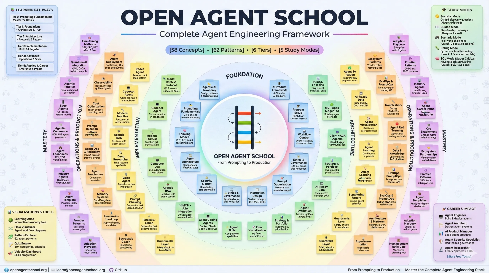

#  Open Agent School

[](https://github.com/bhakthan/OpenAgentSchool/actions/workflows/azure-static-web-apps-gray-pond-041017f10.yml)
[](https://github.com/bhakthan/OpenAgentSchool/releases)
[](LICENSE)
[](https://deepwiki.com/bhakthan/OpenAgentSchool)
[](https://www.linkedin.com/comm/mynetwork/discovery-see-all?usecase=PEOPLE_FOLLOWS&followMember=bhakthan)

> **Where AI Agent Concepts Come to Life**  
> _An interactive learning platform for mastering AI agents, patterns, and production architectures_

<p align="center">
  
</p>

**Live Platform:** [openagentschool.org](https://openagentschool.org)

---

## What's Inside

| | Question | Answer |
|---|----------|--------|
| **Why** | Why does this exist? | Most AI agent resources are scattered blog posts or vendor docs. Open Agent School brings concepts, patterns, and production practices into one interactive platform — so you learn the *why* behind each pattern, not just the API call. |
| **What** | What does it cover? | 65+ agent patterns, 200+ quiz questions, **Duolingo-style micro-learning capsules**, **byte-sized learning cards**, **The Forge cognitive friction lab**, **Cognitive Lab brain-native learning paradigms**, an AI-powered **ConceptSphere** for just-in-time knowledge, interactive D3 visualizations, Socratic study mode, critical thinking challenges, exportable diagrams (SVG/PNG/PDF), and downloadable strategy toolkits — from fundamentals to production ops. |
| **Where** | Where does it run? | **Web** — live at [openagentschool.org](https://openagentschool.org). **PWA** — install on mobile or desktop for offline access. **Local dev** — clone the repo and `npm run dev` on localhost:5000. |
| **When** | When should I use it? | When you're learning AI agents for the first time, need a quick 10-minute daily learning habit, want 60-second byte-sized concept cards for on-the-go learning, want brain-native multi-sensory encoding exercises, want just-in-time answers grounded in live web search, evaluating patterns for a production system, preparing for a technical interview, or onboarding a team to agentic architecture — from first concept to org-wide adoption. |
| **Who** | Who is it for? | Developers building AI agents, architects designing multi-agent systems, product managers evaluating agentic capabilities, and teams adopting AI — from individual learners to enterprise adoption programs. |
| **How** | How is it built? | React 18 + TypeScript + Vite frontend with TailwindCSS and Radix UI. Optional Python FastAPI backend for study sessions and AI-powered assessments. Deployed on Azure Static Web Apps with GitHub Actions CI/CD. |
| **Best For** | What's the sweet spot? | Engineers who learn by doing — byte-sized cards for 60-second concept mastery, micro-learning capsules for daily momentum, Cognitive Lab for multi-sensory neural encoding, ConceptSphere for instant deep-dives, interactive visualizations, hands-on scenarios, and Socratic questioning beat passive reading. Also ideal for teams using the [Adoption Playbook](https://openagentschool.org) to drive org-wide AI transformation. |
| **Keys?** | Do I need API keys? | **No keys required to learn.** The entire platform works without any API keys. When you're ready for AI-powered features (study assessments, voice narration, cloud speech), bring your own keys — they stay in your browser's localStorage and never leave your device. |

---

## What is Open Agent School?

Open Agent School is a **comprehensive educational platform** designed to help developers, architects, and product managers master AI agents — from foundational concepts to advanced production patterns.

###  What You'll Learn

**Core Foundations**
-  **AI Agent Fundamentals** - Architecture, reasoning, tool use, and memory systems
-  **Agent Communication Protocols** - MCP (Model Context Protocol) and ACP (Agent Communication Protocol)
-  **AI Safety & Governance** - Responsible AI practices, security, and compliance frameworks
-  **Evaluation Methods** - Testing, benchmarking, and quality assurance for agents

**Developer Tools & Security**
-  **CLI Coding Agents** - Copilot CLI, Claude Code, Codex CLI, Gemini CLI for terminal-native development
-  **Agent Skills** - Modular SKILL.md files for extending agent capabilities with domain expertise
-  **Agent Red Teaming** - Proactive security testing with PyRIT, attack taxonomies, and ASR metrics

**Advanced Patterns**
-  **Multi-Agent Systems** - Coordination, orchestration, and swarm intelligence
-  **Data Autonomy Patterns** - Perception normalization, schema decomposition, action grounding
-  **2026 Agent Patterns** - Skill-Augmented Agent, MCP Server Orchestration, Multi-LLM Routing, Agentic IDE, Guardrails Layer, IgnitionStack Agent
-  **Business Use Cases** - Commerce, robotics, healthcare, and enterprise applications
-  **Educational Frameworks** - Socratic learning, adaptive tutoring, and skill assessment

**Production Practices**
-  **Deployment & Operations** - Platform ops, monitoring, and continuous improvement
-  **Cost & Value Engineering** - Optimization strategies and ROI frameworks
-  **Human-Centric Adoption** - Change management, HITL workflows, and recovery design
-  **Ecosystem & Partnerships** - Vendor evaluation and integration stewardship

---

##  Key Features

### 🔑 Bring Your Own Keys (BYOK) — Zero-Trust Local Configuration

> **Your keys never leave your browser.** All credentials are stored in `localStorage` under `oas.user.apiSettings`. Nothing is sent to analytics, telemetry, or any third-party service.

- **7+ LLM Providers** — OpenAI, Azure OpenAI, Google Gemini, Anthropic Claude, Hugging Face, OpenRouter, plus **Custom (OpenAI-compatible)** for any endpoint
- **Local LLM Runners** — Ollama (`localhost:11434`) and LM Studio (`localhost:1234`) presets — run models 100% offline, no API key needed
- **International Provider Presets** — DeepSeek, Zhipu AI (GLM), Alibaba Qwen, Moonshot AI, Volcano Engine (China); Mistral (France); Sarvam AI, BharatGen (India)
- **Per-Provider Config** — API key, endpoint URL, and model for each provider with smart defaults and format hints
- **Cloud Speech Services** — OpenAI Whisper, Azure Speech, Deepgram, Google Cloud STT, AWS Transcribe (STT) + OpenAI TTS, OpenAI Audio Model, Azure Speech, ElevenLabs, Google Cloud TTS, AWS Polly (TTS)
- **Self-Hosted Backends** — Override Core API, Orchestrator, and Knowledge Service URLs for local or private deployments
- **Quick Configuration Guide** — 4-step accordion walkthrough that auto-expands when no keys are configured
- **Export / Import** — Share workshop configurations as JSON; merge with existing settings
- **Security-First Design** — Clear trust messaging, amber required-field indicators for Azure, privacy notes front-and-center

Access settings from **Tools → API Settings** in the navigation menu or through the ⚙ gear icon in the top bar.

### 🧠 Micro-Learning — Master AI Agents in 10 Minutes a Day

> **The fastest way to build lasting AI agent expertise.** No hour-long lectures. No endless documentation. Just focused, adaptive capsules designed around how your brain actually learns.

Open Agent School's micro-learning system breaks the entire AI agent curriculum into **bite-sized daily capsules** — each one a focused learning moment you can complete in a coffee break.

- **Six Learning Tracks** — Foundations → Architecture → Protocols → Production → Advanced → Applied. Pick where you are; the system meets you there.
- **5-Stage Capsules** — Every topic follows **Learn → Quiz → Apply → Reflect → Expand** — the same progression elite bootcamps use, compressed into minutes.
- **Adaptive Difficulty** — Questions get harder as you improve, easier when you struggle. No wasted time on what you already know.
- **Spaced Repetition** — Scientifically-proven scheduling resurfaces concepts right before you'd forget them. Knowledge that sticks for months, not hours.
- **Daily Streaks & XP** — Gamification that actually works. Build a learning habit with streaks, levels, and mastery badges.

### 🌐 ConceptSphere — Your AI-Powered Just-In-Time Knowledge Engine

> **Ask anything about AI agents and get an expert answer in seconds** — grounded in live web search, tailored to your learning level.

ConceptSphere is the on-demand knowledge layer that fills the gap between structured courses and real-world questions.

- **8 Ways to Explore Any Topic** — Explain it simply, quiz yourself, expand into adjacent ideas, spark a debate, get the latest research, learn through analogies, see working code, or ask anything custom.
- **Live Web Search Grounding** — Answers aren't just generated — they're anchored in real-time search results from the open web. No stale training data; always current.
- **13 Search Providers** — Tavily, Exa, You.com, Brave, Google, Bing, SerpAPI, Kagi, Mojeek, Yandex, Baidu, Naver, and self-hosted SearXNG. Pick the engine you trust.
- **Works With Your LLM** — Bring any provider (OpenAI, Anthropic, Gemini, Ollama, DeepSeek, Mistral…). Your keys, your model, your data stays local.
- **Instant & Cached** — First answers in seconds; smart caching keeps follow-ups instant.

Micro-Learning and ConceptSphere work together: structured daily capsules build your foundation, and ConceptSphere fills in the gaps the moment a question strikes — **just-in-time learning at its best.**

**Try it:** [openagentschool.org/micro-learning](https://openagentschool.org/micro-learning)

### ⚡ Byte-Sized Learning — AI Concepts in 60 Seconds

> **The fastest way to grasp any AI concept.** 325 ultra-compact learning cards designed for 60-second learning moments — commute, queue, coffee break.

Open Agent School's byte-sized system distills 65 AI agent concepts into **5 card types** each — a multi-angle micro-curriculum you can consume anywhere.

- **5 Card Types Per Concept** — Definition, Logic, Mini-Pattern, Learning Loop, Real-World — each card attacks the concept from a different angle.
- **12 Categories** — Foundations, Architecture, Protocols, Production, Advanced, Applied, Enterprise, Beginner, Security, Evaluation, Cognitive, Specialized.
- **Shared XP & Streaks** — 2 XP per card. Streaks count alongside micro-learning and micro-listening for unified daily engagement.
- **Hybrid Progression** — Category mastery, concept completion badges, and daily streak tracking.
- **Gateway to Depth** — Every card links to full micro-learning capsules and concept pages for deeper exploration.

**Try it:** [openagentschool.org/byte-sized](https://openagentschool.org/byte-sized)

### 🔥 The Forge — Cognitive Friction Lab

> **Train judgment, not output.** 16 exercises across 4 disciplines designed to build the critical thinking skills that separate AI-literate practitioners from prompt copy-pasters.

The Forge is where learners prove they can think — not just prompt. Each discipline targets a different cognitive skill essential for working with AI agents.

- **Socratic Defense** — An LLM-powered examiner probes your AI architecture decisions under Bloom's taxonomy rubric. Defend your reasoning or get exposed.
- **Prompt Autopsies** — Flawed AI-generated output with embedded errors. Find the bugs by precision and recall before the timer runs out.
- **Epistemic Gym** — AI-free timed reasoning challenges. Prove you understand fundamentals without any tools — the gate to the other 3 disciplines.
- **Trust Calibration Lab** — Configure agent autonomy levels for risk scenarios. Scored against expert consensus on the human-AI delegation spectrum.
- **Forge Score** — Aggregate 0-100 metric across all disciplines, integrated into Learner Snapshot.

**Try it:** [openagentschool.org/the-forge](https://openagentschool.org/the-forge)

### 🧠 Cognitive Lab — Brain-Native Learning Paradigms

> **We don't teach you — we sync with your brain.** 7 paradigms that exploit how neurons actually encode — through multi-sensory bursts, contrast, dissonance, and scarcity.

Cognitive Lab goes beyond traditional instruction. Each paradigm targets a different neural encoding pathway, creating deeper and more durable knowledge imprints.

- **Burst Grafting** — 400ms multi-sensory encoding: geometric shape + harmonic chord + 2-word nano-definition flash simultaneously across visual, auditory, and linguistic channels.
- **Void Mapping** — Negative-space definitions: 5 rapid anti-flashes of what a concept is NOT, then pick the real definition from the void. Understanding sharpened by absence.
- **Glitch Resolution** — Cognitive dissonance engine: two contradictory statements that both seem true. Your brain glitches. Then you resolve the contradiction, cementing nuanced understanding.
- **Hemispheric Weaving** — Stereo-split dual processing: left ear receives a poetic metaphor, right ear gets the technical definition. Your brain weaves them into unified understanding.
- **Glyph Cognition** — Symbol-to-meaning recall: study abstract SVG glyphs with seed syllables, then recall the AI concept from memory.
- **Ephemeral Sparks** — One-shot decay learning: knowledge flashes for N seconds then is destroyed forever. Maximum attention yields maximum retention.
- **Bio-Sync** — Biometric-paced learning synced to cardiac rhythm (Phase 2 — coming soon).
- **Seizure Safety** — Photosensitivity warnings with opt-in consent gates, `prefers-reduced-motion` support extends flash timings to 3–5 seconds automatically.
- **Lab Score** — Aggregate metric across all completed paradigm sessions with per-paradigm progress tracking.

**Try it:** [openagentschool.org/cognitive-lab](https://openagentschool.org/cognitive-lab)

###  Interactive Learning Experience

- **59 Core Concepts** across fundamentals, architecture, production, and advanced topics
- **67+ Agent Patterns** with code examples and visualizations
- **Learning Atlas** — Interactive D3 taxonomy tree with exportable diagrams (SVG/PNG/PDF)
- **Study Mode** — Socratic questioning and discovery-based learning
- **Critical Thinking Challenges** — Real-world scenarios with AI-powered assessment
- **Knowledge Quiz** — 200+ questions across 15+ categories

### 🎤 Voice Input & Audio Narration

- **Voice Input** — Speak commands and answers using Web Speech API, Whisper WASM (offline), or 5 cloud STT engines
- **Audio Narrations** — Step-by-step concept narrations at Beginner / Intermediate / Advanced levels
- **29 Languages** — Auto-translated narrations with voice selection, speed, and volume controls
- **Cloud or Local** — Browser-native TTS (free, offline) or 6 premium cloud TTS engines (OpenAI, Azure, ElevenLabs, Google Cloud, AWS Polly)
- **Single-Call Translate + Narrate** — OpenAI Audio Model translates and speaks in one round-trip — no separate LLM key needed

###  Visual Learning Tools

- **D3 Visualizations** — Dynamic, interactive diagrams for complex concepts
- **40+ Atomic Deep-Dive Visualizers** — Slider-driven interactive explorations inside concept tabs
- **Algorithm Walkthroughs** — Step-by-step execution visualizations
- **Export Suite** — SVG, PNG (2x/3x), and PDF export for presentations
- **Dual-Mode Views** — Simple and technical modes for different learning levels

###  Hands-On Practice

- **Code Playbooks** — Runnable code examples in Python and TypeScript
- **Interactive Scenarios** — Debug challenges and failure recovery exercises
- **Live Pattern Runners** — Execute patterns in-browser with real output
- **Strategy Toolkits** — Downloadable canvases and frameworks (XLSX format)

###  Progressive Web App

- **Offline Access** — Content available without internet
- **Install App** — Native app experience on mobile and desktop (menu: Install App)
- **Responsive Design** — Optimized for all screen sizes
- **17 Visual Themes** — 12 dark + 5 light themes with View Transitions API sweep animation

---

##  Quick Start

### For Learners

1. **Visit**: [openagentschool.org](https://openagentschool.org)
2. **Start Micro-Learning**: Head to [/micro-learning](https://openagentschool.org/micro-learning) for daily 10-minute capsules
3. **Try Byte-Sized Cards**: Visit [/byte-sized](https://openagentschool.org/byte-sized) for 60-second concept cards
4. **Train in The Forge**: Visit [/the-forge](https://openagentschool.org/the-forge) for judgment-building exercises
5. **Try Cognitive Lab**: Visit [/cognitive-lab](https://openagentschool.org/cognitive-lab) for brain-native multi-sensory learning
6. **Ask ConceptSphere**: Use the AI-powered knowledge engine for instant just-in-time answers
4. **Explore**: Browse Core Concepts or Agent Patterns
5. **Learn**: Use Study Mode for guided discovery
6. **Practice**: Try interactive scenarios and quizzes

### For Developers

```bash
# Clone the repository
git clone https://github.com/bhakthan/OpenAgentSchool.git
cd OpenAgentSchool

# Install dependencies
npm install

# Start development server
npm run dev

# Open http://localhost:5000
```

### With Local LLM (Ollama or LM Studio)

Run AI-powered features **100% offline** — no API key, no cloud, no cost.

```bash
# Option A: Ollama (recommended)
# 1. Install from https://ollama.com
# 2. Pull a model
ollama pull gemma3:4b          # lightweight 4B model, ~3 GB
# 3. Ollama auto-serves on http://localhost:11434

# Option B: LM Studio
# 1. Install from https://lmstudio.ai
# 2. Download a model via the UI
# 3. Start the local server (serves on http://localhost:1234)
```

Then in the app: **Tools → API Settings → Custom / International / Local** → click the **Ollama** or **LM Studio** preset → change the model name if needed → **Save Settings**. Done — Study Mode, Enlighten Me, and all AI features now run locally.

### With Backend Services (Optional)

```powershell
# Start all three microservices
.\start-backend.ps1

# Services:
# - Core API (8000): User management, quiz, progress
# - Agent Orchestrator (8002): AI agents, critical thinking
# - Knowledge Service (8003): Document processing, semantic search
```

> **Note**: The frontend works standalone. Backend services enable advanced features like user progress tracking and AI-powered assessments.
> Set `VITE_PROFILE_SYNC_ENABLED=false` to keep the new personalization dial local-only and disable backend profile sync calls.

---

##  Documentation

- **[Detailed Documentation](./docs/DETAILED_README.md)** - Comprehensive feature list and architecture
- **[Backend Quick Reference](./BACKEND_QUICK_REF.md)** - Microservices setup and API reference
- **[Agent Guide](./AGENTS.md)** - Guide for AI coding agents contributing to the project
- **[Architecture Overview](./docs/backend/ARCHITECTURE_OVERVIEW.md)** - System design and service dependencies

---

## 🚀 Recent Updates (March 7, 2026)

### 🧠 Cognitive Lab — Brain-Native Learning Paradigms

**7 paradigms** that exploit how neurons actually encode — through multi-sensory bursts, contrast, dissonance, and scarcity. Each paradigm targets a different neural encoding pathway for deeper knowledge imprints.

| Paradigm | Mechanism | What Happens |
|----------|-----------|-------------|
| **Burst Grafting** | Multi-sensory encoding | Shape + chord + nano-definition flash in 400ms across 3 channels |
| **Void Mapping** | Negative-space definition | 5 anti-flashes of what it's NOT → pick the real definition from the void |
| **Glitch Resolution** | Cognitive dissonance | Two contradictory true statements → resolve the contradiction |
| **Hemispheric Weaving** | Stereo-split processing | Left = metaphor, Right = technical → weave into unified understanding |
| **Glyph Cognition** | Symbol-meaning recall | Study abstract SVG glyphs + seed syllables → recall the concept |
| **Ephemeral Sparks** | One-shot decay | Knowledge flashes for N seconds, then destroyed forever |
| **Bio-Sync** | Cardiac-paced learning | Content synced to heartbeat rhythm (Phase 2 — coming soon) |

**Accessibility:** Photosensitivity consent gates, `prefers-reduced-motion` support (flash timings extended to 3–5s), AudioContext Safari fallback with visual-only mode, headphones and flash warning badges on paradigm cards.

**Try it:** [openagentschool.org/cognitive-lab](https://openagentschool.org/cognitive-lab)

---

## 🚀 Recent Updates (March 5, 2026)

### ⚡ Byte-Sized Learning — AI Concepts in 60 Seconds

**325 ultra-compact learning cards** across 65 concepts and 12 categories. Each concept gets 5 card types (Definition, Logic, Mini-Pattern, Learning Loop, Real-World) for multi-angle mastery in 60-second moments.

| Feature | What It Does |
|---------|-------------|
| **5 Card Types** | Definition, Logic, Mini-Pattern, Learning Loop, Real-World — each concept from 5 angles |
| **12 Categories** | Foundations, Architecture, Protocols, Production, Advanced, Applied, Enterprise, Beginner, Security, Evaluation, Cognitive, Specialized |
| **Shared XP & Streaks** | 2 XP per card, unified streak system with micro-learning and micro-listening |
| **Hybrid Progression** | Category mastery, concept completion badges, daily streak tracking |
| **Gateway to Depth** | Cards link to full micro-learning capsules and concept deep-dives |

**Try it:** [openagentschool.org/byte-sized](https://openagentschool.org/byte-sized)

---

## 🚀 Recent Updates (March 2, 2026)

### 🧠 Micro-Learning & ConceptSphere — Just-In-Time AI Agent Education

A complete **Duolingo-style micro-learning system** for mastering AI agents in daily 10-minute sessions, plus **ConceptSphere** — an AI-powered just-in-time knowledge engine that answers any question about AI agents with live web-grounded responses.

| Feature | What It Does |
|---------|-------------|
| **6 Learning Tracks** | Foundations, Architecture, Protocols, Production, Advanced, Applied — 30+ capsules across the full curriculum |
| **5-Stage Capsules** | Learn → Quiz → Apply → Reflect → Expand for each topic |
| **Adaptive Engine** | Difficulty adjusts per learner — harder when you're ready, supportive when you're not |
| **Spaced Repetition** | SM-2 algorithm schedules reviews for long-term retention |
| **ConceptSphere** | 8 exploration modes (Explain, Quiz, Expand, Debate, Latest, Analogy, Code, Custom) |
| **Search-Augmented Generation** | Live web search from 13 providers grounds every answer in current information |
| **Gamification** | XP, daily streaks, level-ups, and mastery badges |

**Try it:** [openagentschool.org/micro-learning](https://openagentschool.org/micro-learning)

---

## 🚀 Recent Updates (February 27, 2026)

### 🧪 Phase 1-3 Feature Expansion — 10 New Pages, Login Required

Ten new full-page features ship behind **AuthGuard** and **feature flags** (localStorage-backed, toggle in Settings → Admin). Infrastructure includes an SSE/WebSocket transport hook (`useEventSource` with auto-reconnect), an IndexedDB offline sync queue (Dexie), and a client-side SM-2 spaced-repetition engine.

| Route | Feature | Phase |
|-------|---------|-------|
| `/phase1-lab` | **Phase 1 Lab** — 4-tab hub: Learning Copilot 2.0, Knowledge Graph Navigator, Pattern Battle Arena, Spaced Repetition Review | 1 |
| `/analytics` | **Learning Analytics** — Self-serve dashboard: level, scores, streaks, study sessions, SR mastery | 1 |
| `/project-tracks` | **Project Tracks** — 3 end-to-end capstone projects with milestone checklists | 2 |
| `/pair-programming` | **Pair Programming Studio** — Split-pane coding exercises with auto-check | 2 |
| `/skill-passport` | **Skill Passport** — Visual skill stamps + PDF certificate generation (jsPDF) | 2 |
| `/cohorts` | **Team Cohorts** — Create/join study groups, mentor rooms, group challenges | 3 |
| `/safety-lab` | **Agent Safety Lab** — 12 red-teaming scenarios, interactive defense exercises, scoring | 3 |
| `/sandbox` | **Multi-Agent Sandbox** — Agent simulation with replay, message inspector, role configs | 3 |

**Community Voting** (Phase 2) adds up/down votes with rate limiting and reputation scoring. **Org Mode** (Phase 3) adds an Organization tab in Admin (team overview, policy compliance, adoption metrics). **Accessibility** improvements include a skip-to-content link and ARIA live-region announcer.

**Backend expansion (core-api):** 5 new API route files (voting, certificates, cohorts, project-tracks, safety-lab), 7 new database tables auto-created on startup, 15 new Pydantic schemas.

---

##  Recent Updates (February 26, 2026)

### 🎨 17 Visual Themes — Full Theme System Overhaul

The platform now ships **17 hand-crafted themes** (12 dark + 5 light) with a theme picker dropdown accessible from the sun/moon button in the navigation bar. Switching themes triggers a **View Transitions API** sweep animation for a polished, directional reveal effect.

| Dark Themes | Light Themes |
|---|---|
| Void Black (default) | Warm Parchment (default) |
| Aurora — northern-lights teal/green | Arctic — cool icy blue |
| Rosé — pink-mauve on charcoal | Sakura — cherry blossom pink |
| Cyber — neon teal/cyan | Sandstone — warm beige/earthy |
| Abyss — deep ocean blues | Ivory — clean cream white |
| Velvet — purple luxe | |
| Ember — warm amber/orange | |
| Verdant — nature green | |
| Solar — warm gold/yellow | |
| Mono — pure grayscale | |
| Crimson — blood red | |
| Malachite — emerald green | |

**Technical details:** Each theme maps to the same shadcn/ui CSS variable names (`--background`, `--foreground`, `--card`, `--primary`, `--muted`, `--border`, etc.) so every component works with any theme. The `ThemeProvider` derives an `isDarkMode` boolean from a `DARK_THEMES` set, ensuring Tailwind `dark:` variants remain correct across all 17 themes. Theme preference is persisted to `localStorage` under the `ui-theme` key.

See [THEME.md](./THEME.md) for the full theme reference (swatches, CSS variables, and developer guide).

---

##  Previous Updates (February 21, 2026)

### 🌍 Full Cloud Speech Provider Coverage (NEW)

All major cloud platforms now supported for voice input and audio narration — **11 cloud speech services** across 5 STT and 6 TTS engines:

| Provider | STT | TTS | Notes |
|----------|-----|-----|-------|
| **OpenAI** | Whisper API | TTS (alloy, coral, etc.) | Direct API key |
| **OpenAI Audio Model** | — | Translate + narrate in 1 call | gpt-4o-mini-audio-preview, Azure OpenAI |
| **Azure** | Cognitive Speech | Neural TTS (400+ voices) | Enterprise, region-based |
| **Deepgram** | Nova-2 | — | Real-time streaming |
| **ElevenLabs** | — | Multilingual v2 | Ultra-realistic voices |
| **Google Cloud** | Speech-to-Text v1 | TTS (WaveNet / Neural2) | Falls back to Gemini key |
| **AWS** | Transcribe (via proxy) | Polly (via proxy) | Requires backend relay for SigV4 |

**Design note:** Google Cloud APIs work directly with an API key. AWS APIs require SigV4 signing and use a configurable proxy/backend endpoint — the Settings UI clearly communicates this requirement.

---

##  Previous Updates (February 21, 2026)

### 🔑 BYOK Configuration & Local Storage Settings (NEW)

Learners who clone the repo or use the live platform can now **bring their own API keys** — stored entirely in the browser's `localStorage`, never transmitted anywhere.

| Feature | Details |
|---------|--------|
| **LLM Providers** | OpenAI, Azure OpenAI, Google Gemini, Anthropic Claude, Hugging Face, OpenRouter, Custom (OpenAI-compatible) — plus local runners (Ollama, LM Studio) and international presets (DeepSeek, Zhipu AI, Alibaba Qwen, Moonshot AI, Volcano Engine, Mistral, Sarvam AI, BharatGen) |
| **Smart Defaults** | Provider-specific placeholders (key format hints like `sk-…`, `AIza…`), default URLs, suggested models |
| **Required Fields** | Azure OpenAI URL and deployment model show red asterisk indicators with amber warning messages |
| **Cloud STT** | OpenAI Whisper API, Azure Cognitive Speech, Deepgram, Google Cloud Speech-to-Text, AWS Transcribe (via proxy) — beyond the free browser Web Speech API and offline Whisper WASM |
| **Cloud TTS** | OpenAI TTS, OpenAI Audio Model (translate + speak in 1 call), Azure Speech, ElevenLabs, Google Cloud TTS (WaveNet / Neural2), AWS Polly (via proxy) — premium voices alongside free browser-native narration |
| **Self-Hosted Backends** | Override Core API, Orchestrator, Knowledge Service URLs for private deployments |
| **Export / Import** | Share workshop configs as JSON; import merges with existing settings |
| **Security** | Privacy notes at the top of settings, clear trust banner, no telemetry |

**How to use:** Navigate to **Tools → API Settings** or click the ⚙ gear icon. A 4-step Quick Configuration Guide auto-expands when no keys are configured.

### 🎤 Voice Input — Speak to the Platform

All text inputs now accept **voice dictation** with a microphone button. Engine priority:

1. **Web Speech API** (free, real-time, browser-native)
2. **Whisper WASM** (offline fallback, lazy-loaded ~40 MB model)
3. **Cloud STT** (OpenAI Whisper, Azure Speech, Deepgram, Google Cloud, AWS Transcribe) when configured in BYOK settings

Voice also powers **navigation**: say "go to patterns" or "open study mode" to navigate hands-free.

### 🗂 Mega-Menu Navigation Redesign

The top navigation has been reorganized into **four color-coded categories** with a dropdown mega-menu:

| Category | Color | Contains |
|----------|-------|----------|
| **Learn** | Blue → Cyan | Core Concepts, Agent Patterns, Learning Atlas, References |
| **Apply** | Amber → Orange | Agents for Science, Adoption Playbook, Applied AI Skills, Azure Services |
| **Practice** | Emerald → Teal | Study Mode, Knowledge Quiz, Knowledge Search, Community |
| **Tools** | Violet → Purple | API Docs, Agents Console, API Settings |

New items show a pulsing gold badge. Mobile gets a grouped dropdown menu with the same color scheme.

---

##  Previous Updates (February 16, 2026)

### 🔊 XYZ-Claw: Multi-Agent Orchestration — Audio Narrations

Step-by-step audio narrations at three levels (Beginner ~4 min, Intermediate ~6 min, Advanced ~7 min), powered by Web Speech API or cloud TTS. Supports **29 languages** with auto-translation, voice selection, speed control, and volume adjustment.

### ⚛ Atomic Deep-Dive Tabs — Interactive Concept Visualizers

40+ slider-driven, interactive visualizations across 10 concept pages (Reasoning, Memory, Fine-Tuning, Multi-Agent, Prompt Injection, Architecture, MCP, Evaluation, Observability, Cost Optimization). Each gains an **⚛ Atomic** tab with a Challenge Ladder (Observe → Predict → Experiment → Synthesize).

---

##  Previous Updates (February 14, 2026)

### Atomic LLM Training (microGPT)
- Build a dependency-free GPT in ~200 lines of pure Python
- 5 progressive tabs, 10 embedded interactive visuals, 10 quiz questions
- Tier 1 Fundamentals concept — no prerequisites

---

##  Previous Updates (February 5, 2026)

### New Concepts

🆕 **AI-Ready Data: From Data to Decisions**
- Comprehensive 8-part framework for enterprise AI data readiness
- Visible Cracks: Data constraints (semantic drift, ownership, lineage)
- The Trust Trap: Trust erosion mechanisms and automation risks
- Shadow Forces: Organizational dynamics (hoarding, gaming, blame avoidance)
- Decision DNA: Systematic decision capture methodology
- Trust Architecture: Six dimensions of data quality contracts
- The Ladder: 5-stage maturity progression (Raw → Autonomous)
- The Flywheel: Implementation strategy and momentum building
- The Imperative: Strategic positioning and competitive urgency
- 8 Socratic questions for discovery-based learning
- Prerequisite concept for Data & Knowledge Operations

---

##  Previous Updates (January 31, 2026)

### New Concepts
- **MCP Apps & Agent UI** — Interactive UI standard for AI agents (`ui://` pattern, sandboxed iframes, cross-platform SDKs)
- **CLI Coding Agents** — Copilot CLI, Claude Code, Codex CLI, Gemini CLI with AGENTS.md/CLAUDE.md patterns
- **Agent Skills** — SKILL.md specification for modular agent expertise
- **Agent Red Teaming** — PyRIT framework, 5 attack types, 10 risk categories, ASR metrics
- **Agent Troubleshooting Playbook** — Failure taxonomy, diagnostic decision trees, emergency runbooks
- **Agent Economics** — Cost modeling, pricing strategies, ROI framework, Make vs Buy
- **Agent Career Paths** — 7 roles ($80K–$300K), 4-level skill progression, 6 certifications
- **Industry-Specific Agents** — 6 verticals (Healthcare, Finance, Legal, Education, Manufacturing, Retail)
- **Agent Templates Hub** — 5 starter templates (Basic → Production-Ready), quickstart guides

### 2026 Agent Patterns
- Skill-Augmented Agent, MCP Server Orchestration, Multi-LLM Routing, Agentic IDE, Guardrails Layer

### Production Foundations
- Agent Reasoning Patterns (CoT, ToT, GoT, ReAct)
- Agent Memory Systems (short/long-term, episodic, semantic)
- Agent Observability (OpenTelemetry, LangSmith)
- Agent Testing & Benchmarks (SWE-Bench, GAIA, WebArena)
- Prompt Injection Defense
- Human-in-the-Loop Patterns
- Agent Cost Optimization (50–90% cost reduction strategies)

---

##  Previous Updates (September 30, 2025)

- PWA install experience: "Install App" menu item, platform-specific dialogs, one-click install
- Console cleanup: suppressed CORS errors, Workbox debug logs, ref warnings
- Documentation restructure: simplified main README, details moved to docs/

---

##  Learning Paths

### **Navigation Design Philosophy**

The top navigation uses a **four-category mega-menu** that mirrors the learning lifecycle:

| Category | Purpose |
|----------|--------|
| **Learn** | Foundation — Core Concepts, Agent Patterns, Learning Atlas, References |
| **Apply** | Real-world — Agents for Science, Adoption Playbook, Applied AI Skills, Azure Services |
| **Practice** | Hands-on — Study Mode, Knowledge Quiz, Knowledge Search, Community, Cognitive Lab, Phase 1 Lab, Learning Analytics, Project Tracks, Pair Programming, Cohorts, Sandbox |
| **Tools** | Config — API Docs, Agents Console, **API Settings (BYOK)**, Skill Passport |

**Rationale**: Learners progress from **Learn** (concepts) → **Apply** (real-world use) → **Practice** (exercises) → **Tools** (configure your own environment). The BYOK settings are in Tools so learners can get started immediately without keys and configure providers when they're ready for AI-powered features.

###  **Beginner Path** (Start Here)
1. Core Concepts → Agent Fundamentals
2. Learning Journey Map (interactive progression)
3. Knowledge Quiz (assess comprehension)
4. Study Mode: Socratic Questions

###  **Intermediate Path**
1. Agent Patterns → Educational Patterns
2. Multi-Agent Systems
3. Data Strategy Visualization
4. Code Playbooks & Examples

###  **Advanced Path**
1. Data Autonomy Patterns (8 foundational patterns)
2. Critical Thinking Challenges
3. Production Operations & Monitoring
4. Strategy Toolkits (downloadable canvases)

### 🔑 **Self-Hosted / BYOK Path**
1. Clone the repo and `npm run dev`
2. Open **Tools → API Settings** — configure your preferred LLM provider
3. Enable cloud STT/TTS if desired (optional — browser-native works out of the box)
4. Override backend URLs to point at your own Core API, Orchestrator, or Knowledge Service
5. Export your config as JSON for teammates or workshop participants

### **🆕 Organizational Adoption Path**
1. Adoption Playbook → Mission Brief (discovery questions)
2. Transformation Journey (5-phase roadmap)
3. Operating System Design (governance, platform, culture)
4. Activation Plan (first 90 days)
5. Study Mode: Adoption Strategy challenges

### 🧠 **Micro-Learning Path** (New — 10 min/day)
1. Start with **Byte-Sized Cards** at [/byte-sized](https://openagentschool.org/byte-sized) for 60-second concept previews
2. Pick a track: Foundations, Architecture, Protocols, Production, Advanced, or Applied
3. Complete daily capsules: Learn → Quiz → Apply → Reflect → Expand
3. Let spaced repetition schedule your reviews automatically
4. Use ConceptSphere for instant deep-dives on any question that comes up
5. Build streaks, earn XP, and level up across all tracks
6. Graduate to Study Mode or Project Tracks when you're ready for longer sessions

### 🧠 **Cognitive Lab Path** (New — Brain-Native Encoding)
1. Start at [/cognitive-lab](https://openagentschool.org/cognitive-lab) and pick a paradigm
2. Try **Burst Grafting** first — multi-sensory flash encoding is the fastest on-ramp
3. Progress to **Void Mapping** and **Glitch Resolution** for deeper cognitive engagement
4. Use **Hemispheric Weaving** with headphones for stereo-split dual processing
5. Test recall with **Glyph Cognition** — map abstract symbols to AI concepts
6. Challenge yourself with **Ephemeral Sparks** — one-shot learning, no second chances
7. Track your Lab Score across all paradigms

### 🔬 **Hands-On Builder Path** (New)
1. Phase 1 Lab → Learning Copilot (get personalized weekly plan)
2. Project Tracks → Pick a capstone (Support Bot, RAG Tutor, or Commerce Agent)
3. Pair Programming Studio → Complete guided coding exercises
4. Pattern Battle Arena → Compare patterns before implementation
5. Safety Lab → Red-team your agent before shipping
6. Skill Passport → Generate PDF certificate for completed tracks

---

##  Contributing

We welcome contributions! Whether it's:

-  **Bug Reports** - Found an issue? [Open an issue](https://github.com/bhakthan/OpenAgentSchool/issues)
-  **Feature Requests** - Have an idea? We'd love to hear it!
-  **Documentation** - Help improve our guides
-  **Code Contributions** - Submit a pull request

See **[AGENTS.md](./AGENTS.md)** for guidance on contributing code.

---

##  Platform Stats

- **59 Core Concepts** across 8 learning tiers
- **67+ Agent Patterns** (Core + Educational + Data Autonomy + Quantum/Robotics + Deep Research + 2026 Patterns)
- **200+ Quiz Questions** across 15+ categories
- **90+ Interactive Visualizations** (D3, React Flow, custom diagrams, 40+ atomic deep-dive visualizers)
- **10 Atomic Deep-Dive Tabs** with slider-driven interactive concept explorers
- **8 Strategy Toolkits** (downloadable XLSX canvases)
- **7+ LLM Providers** supported in BYOK settings (OpenAI, Azure, Gemini, Claude, Hugging Face, OpenRouter, Custom) plus Ollama, LM Studio, DeepSeek, Zhipu AI, Qwen, Moonshot, Mistral, Sarvam AI, BharatGen presets
- **11 Cloud Speech Services** (5 STT + 6 TTS) alongside free browser-native options
- **29 Languages** for audio narration with auto-translation
- **17 Visual Themes** — 12 dark + 5 light with View Transitions API sweep animation
- **6 Micro-Learning Tracks** with 30+ bite-sized capsules, adaptive difficulty, and spaced repetition
- **325 Byte-Sized Learning Cards** across 65 concepts, 12 categories, and 5 card types (60-second learning moments)
- **ConceptSphere JIT Engine** — 8 exploration modes with search-augmented generation across 13 web search providers
- **7 Cognitive Lab Paradigms** — Brain-native multi-sensory encoding (burst grafting, void mapping, glitch resolution, hemispheric weaving, glyph cognition, ephemeral sparks, bio-sync)
- **7 Learning Modes** (Micro-Learning, Byte-Sized, Cognitive Lab, Concepts, Study, Critical Thinking, Interactive Scenarios, Debug Challenges)
- **10 New Feature Pages** behind auth + feature flags (Phase 1 Lab, Analytics, Project Tracks, Pair Programming, Skill Passport, Cohorts, Safety Lab, Sandbox)

---

##  Technology Stack

**Frontend**
- React 18 + TypeScript + Vite
- TailwindCSS 4 + Radix UI (Sheet, Accordion, RadioGroup, Alert, Navigation Menu, …)
- D3.js for visualizations
- React Flow for agent workflows
- Web Speech API + Whisper WASM for voice input
- 11 cloud speech services (Google Cloud, AWS, OpenAI, Azure, Deepgram, ElevenLabs)
- localStorage BYOK for zero-server key management

**Backend (Optional)**
- Python 3.12 + FastAPI
- PostgreSQL + DuckDB
- OpenAI/Anthropic/Azure OpenAI
- Docker Compose

**Infrastructure**
- Azure Static Web Apps
- GitHub Actions CI/CD
- Progressive Web App (PWA)
- Service Worker caching

---

##  License

MIT License - see [LICENSE](LICENSE) for details.

---

##  Acknowledgments

Built with  by the Open Agent School community, powered by AI assistance and lots of human expertise.

**Special Thanks:**
- Microsoft Learn AI documentation
- OpenAI, Anthropic, Google, and Azure AI teams
- Open source community (React, D3, Vite, and countless libraries)

---

##  Contact & Community

- **Website**: [openagentschool.org](https://openagentschool.org)
- **GitHub**: [github.com/bhakthan/OpenAgentSchool](https://github.com/bhakthan/OpenAgentSchool)
- **Issues**: [Report bugs or request features](https://github.com/bhakthan/OpenAgentSchool/issues)

---

<div align="center">

**Start your AI agent learning journey today!** 

[Visit Open Agent School ](https://openagentschool.org)

</div>
